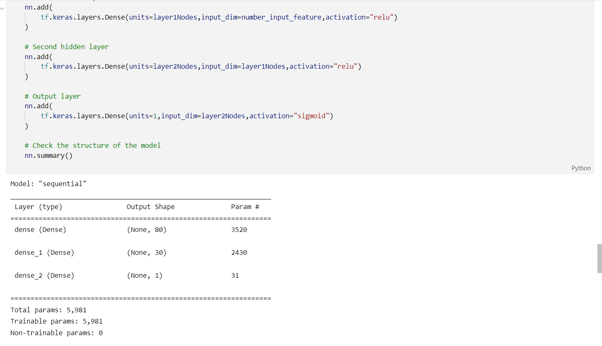
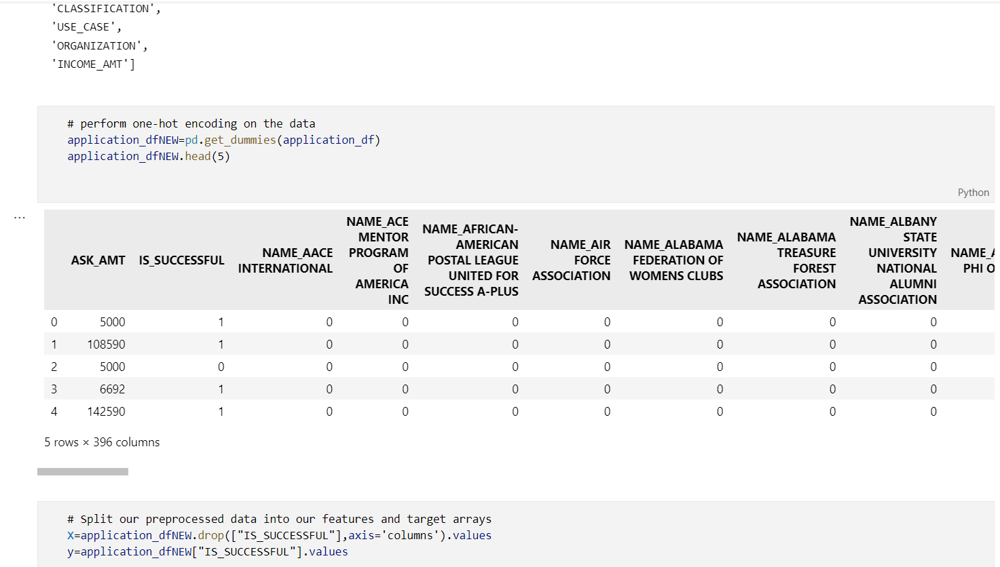

# Deep-Learning: Charity Funding Predictor Analysis

Background

The non-profit foundation Alphabet Soup wants to create an algorithm to predict whether or not applicants for funding will be successful. With your knowledge of machine learning and neural networks, you’ll use the features in the provided dataset to create a binary classifier that is capable of predicting whether applicants will be successful if funded by Alphabet Soup.
From Alphabet Soup’s business team, you have received a CSV containing more than 34,000 organizations that have received funding from Alphabet Soup over the years. Within this dataset are a number of columns that capture metadata about each organization, such as the following:

EIN and NAME—Identification columns

APPLICATION_TYPE—Alphabet Soup application type

AFFILIATION—Affiliated sector of industry

CLASSIFICATION—Government organization classification

USE_CASE—Use case for funding

ORGANIZATION—Organization type

STATUS—Active status

INCOME_AMT—Income classification

SPECIAL_CONSIDERATIONS—Special consideration for application

ASK_AMT—Funding amount requested

IS_SUCCESSFUL—Was the money used effectively

Overview of the analysis: 

Use the features in the provided dataset to create Neural network binary classifier that is capable of predicting whether applicants will be successful if funded by Alphabet Soup.

Step 1: Preprocess the data

Read in the charity_data.csv to a Pandas DataFrame, and be sure to identify the following in the dataset:

What variable(s) are considered the target(s) for my model?
What variable(s) are considered the feature(s) for my model?

Drop the EIN and NAME columns.
Determine the number of unique values for each column.
For those columns that have more than 10 unique values, determine the number of data points for each unique value.
Use the number of data points for each unique value to pick a cutoff point to bin "rare" categorical variables together in a new value, Other, and then check if the binning was successful.
Use pd.get_dummies() to encode categorical variables

Step 2: Compile, Train, and Evaluate the Model
Design a neural network, or deep learning model, to create a binary classification model that can predict if an Alphabet Soup–funded organization will be successful based on the features in the dataset. 

Step 3: Optimize the Model
Optimize the model in order to achieve a target predictive accuracy higher than 75%. If I can't achieve an accuracy higher than 75%, I'll need to make at least three attempts to do so.
Optimize the model in order to achieve a target predictive accuracy higher than 75% by using any or all of the following:

Adjusting the input data to ensure that there are no variables or outliers that are causing confusion in the model, such as:

Dropping more or fewer columns.
Creating more bins for rare occurrences in columns.
Increasing or decreasing the number of values for each bin.

Adding more neurons to a hidden layer.
Adding more hidden layers.
Using different activation functions for the hidden layers.
Adding or reducing the number of epochs to the training regimen.

Results:

What variable(s) are considered the target(s) for your model? -IS_SUCCESSFUL 

What variable(s) are considered to be the features for your model?
-APPLICATION_TYPE,AFFILIATION,CLASSIFICATION,USE_CASE,ORGANIZATION,STATUS,INCOME_AMT,SPECIAL_CONSIDERATIONS,ASK_AMT

What variable(s) are neither targets nor features, and should be removed from the input data?
-EIN, NAME

Summary: Summarize the overall results of the deep learning model. Include a recommendation for how a different model could solve this classification problem, and explain my recommendation.

Here are some screenshots of my work:

